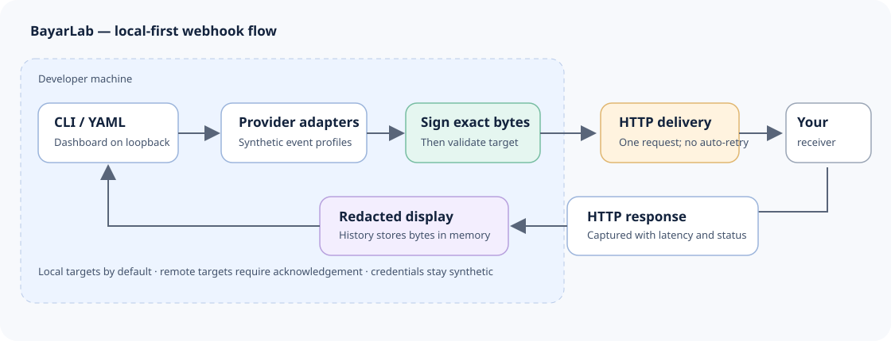

# BayarLab

BayarLab is a local payment-webhook simulator for Indonesian developers. It builds synthetic, provider-shaped notifications, signs them with local test credentials, and lets you inspect or deliver them to a development endpoint. It does not create payments, contact payment gateways, or require real credentials.

The project is in active development (0.1.0 release candidate; not yet published). Implemented profiles are deliberately narrow: Midtrans Classic (BNI VA and selected card notifications), Xendit Payments API v3 (Indonesia DANA), and DOKU Direct API non-SNAP (Mandiri VA). See the [provider matrix](docs/provider-matrix.md) and provider-specific [Midtrans](docs/providers/midtrans.md), [Xendit](docs/providers/xendit.md), and [DOKU](docs/providers/doku.md) notes for fidelity limits and fixture provenance. No real sandbox callbacks have been captured.

## Try it locally

Requirements: Node.js 22.13.0 or newer and pnpm 11 or newer.

```bash
pnpm install
pnpm build
pnpm --filter @bayarlab/cli start providers
pnpm --filter @bayarlab/cli start inspect midtrans settlement --output json
```

To send a signed synthetic notification, start the matching local example receiver in one terminal and send the event from another. For example:

```bash
pnpm midtrans:receiver
pnpm --filter @bayarlab/cli start send midtrans settlement --to http://127.0.0.1:3000/webhook
```

Each command runs in a separate terminal. Try `--invalid-signature --expect-status 401` to exercise rejection, or `--repeat 2 --same-event-id` to test duplicate handling. Receivers bind to loopback and use synthetic local defaults. Keep test credentials local; never point the simulator at production systems or use real payment credentials.

Run the local dashboard with `pnpm ui`. It listens on `127.0.0.1:8787`. For CLI commands, environment variables, exit codes, and replay semantics, see the [CLI guide](docs/cli.md); for dashboard security and behavior, see the [dashboard guide](docs/dashboard.md).

## Development

```bash
pnpm install
pnpm build
pnpm lint
pnpm typecheck
pnpm test
pnpm smoke:packages
pnpm smoke:release
```

The package smoke check assumes a successful build. See [CONTRIBUTING.md](CONTRIBUTING.md) to set up the repository and propose changes. New provider implementations should follow the [provider adapter guide](docs/provider-adapter-guide.md). The [architecture overview](docs/architecture.md) includes a component diagram, and [demo-recording.md](docs/demo-recording.md) has a short GIF capture plan. Current release findings and remediation gates are recorded in the [release candidate audit](docs/release-candidate-audit.md).

The architecture diagram is shown below. [Express and Next.js receiver examples](docs/examples-webhook-receivers.md) and [0.1.0 draft release notes](docs/releases/v0.1.0.md) are also available. The short demo is still awaiting a real capture and maintainer frame review; see the [recording guide](docs/demo-recording.md).



## What is included

- `apps/cli`: the `bayarlab` CLI for listing providers, inspecting signed events offline, sending notifications, running scenarios, and chaos testing.
- `apps/web`: the loopback-only local dashboard.
- `packages/core`, `provider-contract`, and `engine`: shared domain types, adapter contract, request signing/delivery, response capture, and redacted display.
- `packages/providers/{demo,midtrans,xendit,doku}`: synthetic demo and the scoped provider profiles described in the provider matrix.
- `packages/scenario`: YAML scenario parsing, deterministic fixtures, and CI-friendly reports.

BayarLab is a development simulator, not a payment gateway, provider certification tool, or production webhook sender. Read [SECURITY.md](SECURITY.md) before reporting a vulnerability and [CODE_OF_CONDUCT.md](CODE_OF_CONDUCT.md) before participating. Licensed under [MIT](LICENSE), copyright BayarLab contributors.

## Release artifact (not yet published)

The root package is the public executable `bayarlab`; internal `@bayarlab/*` packages remain private. `pnpm build` creates one Node ESM bundle with the CLI, engine, scenarios, and adapters plus the compiled dashboard assets. The allowlisted archive contains no workspace dependencies or test/build metadata. Only Commander, Fastify, YAML, and Zod remain external runtime dependencies.

The compiled dashboard includes React, React DOM, and Scheduler; their license/copyright notices are copied from the installed dependencies into `dist/licenses` in the release archive.

```bash
pnpm build
pnpm smoke:release
npm pack
# In a separate empty directory, use the absolute path to the generated tarball:
npm install /absolute/path/to/bayarlab-0.1.0.tgz
npm exec --no -- bayarlab --help
npm exec --no -- bayarlab ui
```

`smoke:release` packs and installs the tarball in an isolated temporary consumer, checks the installed executable (including npm exec with registry fallback disabled), all provider inspections, exit codes, and dashboard assets, then removes its temporary files. It needs registry access for runtime dependencies and permission to bind to loopback. This repository does not publish automatically. Do not run an unpinned `npx bayarlab` against the public registry until the candidate is approved and published.
