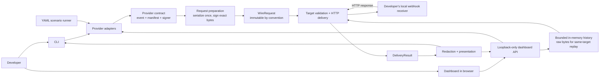

# Architecture

BayarLab separates provider-specific event construction and authentication from transport, CLI/dashboard interaction, and display formatting. The diagram below shows the main request path and the security boundary between the local developer machine and the merchant receiver.




The network boundary is the receiver chosen by the developer. BayarLab validates targets before sending and does not automatically follow redirects or retry failed deliveries. The dashboard binds only to loopback and protects its local API with a process-local session token. Secrets and unredacted request bytes remain in process memory only as needed; display representations are redacted.

## Request lifecycle

The engine accepts provider events and sends byte-for-byte signed requests to a target URL. The demo provider exercises this path without claiming compatibility with a payment gateway. The [provider matrix](provider-matrix.md) defines future real-provider scope.

```text
ProviderAdapter.buildEvent
    → ProviderEvent (provider body, internal metadata)
    → prepareSignedRequest (JSON bytes, target path, adapter signer)
    → WireRequest (immutable-by-convention signed bytes)
    → deliver (target validation, one HTTP POST, response capture)
    → DeliveryResult (raw in-process record)
    → formatDelivery / toDisplayResult (redacted output)
```

The adapter signs bytes after serialization. Its input includes the effective path and query, so future DOKU-style signatures can depend on the actual destination. The engine sends the returned bytes directly and controls Host and Content-Length headers. A replay calls `deliver` again with the same `WireRequest`; each attempt gets a new `requestId`. The adapter's internal `eventId` is not inserted into a provider payload unless that provider actually has such a field.

The normalized `PaymentState` and `Scenario` types describe internal state and sequences. The scenario runner executes YAML steps by building and delivering provider events in order; it does not make a provider-side payment or verify order fulfillment. `DeliveryResult.response.status` reports only the merchant endpoint's HTTP status.

## Delivery policies

- Local loopback and private network addresses work by default. A public or production-labelled target needs `allowRemoteTarget`. The CLI exposes `--allow-remote-target` for its synthetic demo.
- The engine resolves a hostname, validates every returned address, then connects to a selected IP while retaining the original Host header and TLS server name. This prevents a second DNS lookup from selecting a different destination during connection.
- HTTP(S) only; embedded URL credentials, fragments, unsafe and link-local addresses are rejected. Redirects are recorded as 3xx and not followed.
- Requests are capped at 1 MiB. Response capture is capped at 1 MiB and marked truncated. Total HTTP delivery timeout defaults to 15 seconds, configurable up to two minutes. There are no automatic retries.
- Invalid target, DNS, signing and request errors throw `BayarLabError` before HTTP delivery. Network failures and timeouts return `DeliveryResult.error` with elapsed time. The CLI's demo command exits 0 on 2xx, 1 for failed HTTP delivery or non-2xx, and 2 for pre-delivery errors.
- Default output masks known sensitive header/body keys and URL query keys. A caller passes active secrets to the formatter to mask any reflected occurrences. The unredacted wire request remains in process memory for replay; display output must not be used as a replay source.

The current hostname heuristic recognizes `prod` and `production` labels. It is a guardrail, not a reliable detector of an organization's environment.

## Phase 5 local dashboard

`apps/web` bundles a React/Vite client and exposes a Fastify service only on `127.0.0.1`. The browser obtains one random process-local token from `GET /api/session`; preview/send/replay require it in `x-bayarlab-session`. The service rejects non-local Host headers and cross-origin browser requests, and it does not set permissive CORS headers. It stores unredacted request bytes only in its bounded in-memory history so replay can call `deliver` without rebuilding or re-signing; all API display representations are produced by `toDisplayResult` and are redacted.

## Demo signature

The synthetic demo adapter signs `pathAndQuery + "." + rawJsonBodyBytes` using HMAC-SHA256 and places the lowercase hex digest in `x-bayarlab-signature`. Use `bayarlab-local-test-key` or the same `BAYARLAB_DEMO_SECRET` value on both sides. This convention is only for testing the Phase 2 engine.
